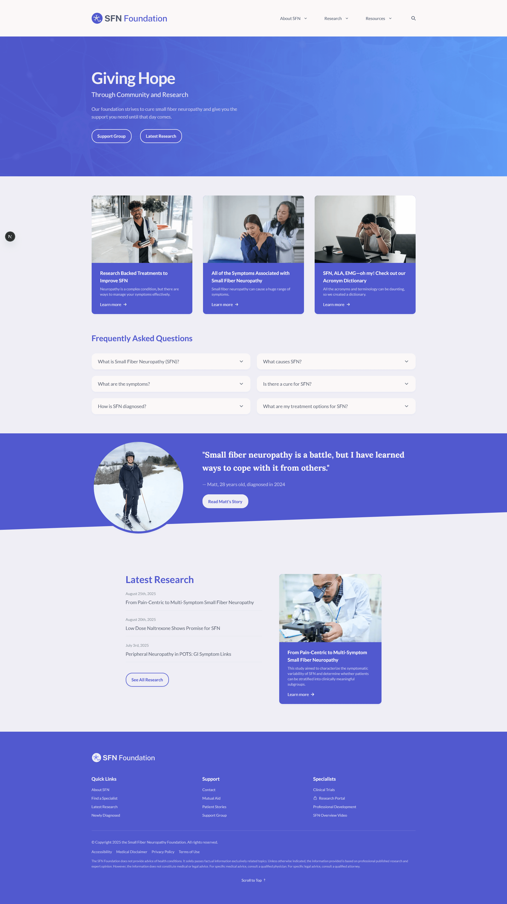

## Overview
This project has two focused goals:

- Provide clear, evidence-based information and awareness for people affected by Small Fiber Neuropathy (SFN), caregivers, and clinicians.
- Host a clinician/researcher portal where specialists can upload and curate the latest research; that corpus will be used (with consent and privacy safeguards) to train models and tools aimed at accelerating research toward effective treatments for SFN.





## Research portal & ethics
The research portal is designed for specialists to contribute primary research, reviews, and clinical findings. Any use of contributed data for model training will follow privacy, consent, and ethics best practices. This repository documents the project — operational details, governance, and data-use policies should be configured by the foundation and participating institutions.

## Quick start
Clone, install, and run the dev server:

```bash
git clone https://github.com/YOUR-USERNAME/sfn-foundation.git
cd sfn-foundation
npm install
npm run dev
```

## Where to edit
- Site pages and components: `src/app` and `src/components`
- Content and data: `src/content`
- Public assets (logo, screenshots): `public/logos` and `public/images`

## Contributing
Contributions are welcome. Please open issues or pull requests for fixes, content updates, or feature suggestions. For research uploads and data governance, contact the foundation to arrange contributor agreements and data-use terms.

## License & contact
MIT License — see `LICENSE`.

Website: https://sfn-foundation.org
Contact: info@sfnfoundation.org

## Summary
This repo is a Next.js site that combines public-facing educational content with a specialist research portal intended to power research tooling (including model training) under responsible, consent-driven governance.